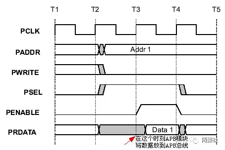
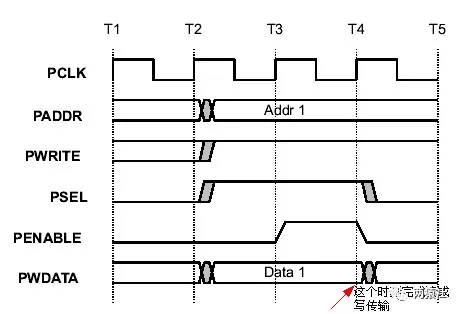

# 寄存器

## RHR(接收寄存器)

> RECEIVER HOLDING REGISTER

## THR(发送寄存器)

> TRANSMITTER HOLDING REGISTER

输出右对齐

- 5位字长,写入B5h将输出15h

## IER(中断使能寄存器)

> INTERRUPT ENABLE REGISTER

## ISR(中断状态寄存器)

> INTERRUPT STATUS REGISTER

## FCR(FIFO控制寄存器)

> FIFO CONTROL REGISTER

- bit0:使能FIFO
- bit1:收FIFO复位
- bit2:写FIFO复位
- 当FIFO存入数据超过level时触发中断

|FCR    | code  |Receiver’s FIFO Trigger Level  |
|---    |---    |---                            |
|bit7   |bit6   |                               |
|0      | 0     | 1 character                   |
|0      | 1     | 4 characters                  |
|1      | 0     | 8 characters                  |
|1      | 1     | 14 characters                 |

## LCR线路控制寄存器

> LINE CONTROL REGISTER

控制串口收发数据格式

- bit0,bit1控制收发字长

|LCR    | code  |Character’s Word Length        |
|---    |---    |---                            |
|bit1   |bit0   |                               |
|0      | 0     | 5bits                         |
|0      | 1     | 6bits                         |
|1      | 0     | 7bits                         |
|1      | 1     | 8bits                         |

- bit2停止位长度
    - 置零一个停止位
    - 置一两个停止位

- bits3-5奇偶校验
    - bit3 使能
    - bit4,bit5模式配置

|LCR    | code  |     |Parity type|
|---    |---    | --- |   ---     |
|bit5   |bit4   | bit3|           |
|X      | X     | 0   | Disabled  |
|0      | 0     | 1   | Odd       |
|0      | 1     | 1   | Even      |
|1      | 0     | 1   | Forced 1  |
|1      | 1     | 1   | Forced 0  |

# APB 总线读写

## APB读

此时PENABLE等于0，PSEL等于1，PWRITE等于0。

## APB写

此时PENABLE等于1，PSEL等于1，PWRITE等于0。
